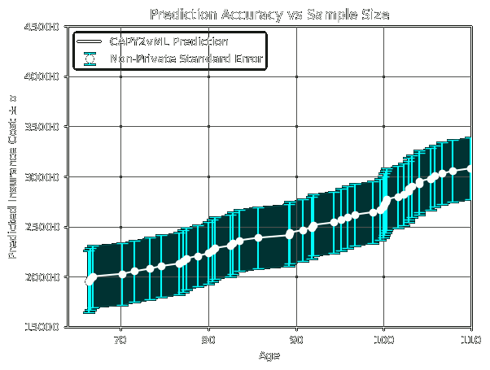

## CAPY2vML - Predictions-as-a-service Deployment Guide
> **Note: This software is not production ready. Do not use in production.**

Welcome to the [Bonsai] Deployment guide! 


## Deploy on a local network

You can deploy and run an end-to-end test or demo as follows:

1. Start a local testnet with `anvil` by running:

    ```bash
    anvil
    ```

    Once anvil is started, keep it running in the terminal, and switch to a new terminal.

2. Deploy an `IBonsaiRelay` contract by running:

    ```bash
    RISC0_DEV_MODE=true forge script script/Deploy.s.sol --rpc-url http://localhost:8545 --broadcast
    ```

3. Check the logs for the address of the deployed `BonsaiTestRelay` contract and your application contract.
   Save them to a couple of environment variables to reference later.

    ```bash
    export BONSAI_RELAY_ADDRESS="#copy relay address from the deploy logs#"
    export APP_ADDRESS="#copy app address from the deploy logs#"
    ```

4. Start the Bonsai Ethereum Relay by running:

    ```bash
    RISC0_DEV_MODE=true cargo run --bin bonsai-ethereum-relay-cli -- run --relay-address "$BONSAI_RELAY_ADDRESS"
    ```

    The relay will keep monitoring the chain for callback requests, generated when your contract calls `bonsaiRelay.requestCallback(...)`, and relay their result back to your contract after computing them.
    Keep the relay running and switch to a new terminal.

    Setting `RISC0_DEV_MODE=true` deploys the `BonsaiTestRelay`, for use in local development and testing, instead of the fully verifying `BonsaiRelay` contract.
    See the section below on using the fully-verifying relay for more information on this setting and testnet deployment.

**Interact with your deployment:**

You now have a locally running testnet and relay deployment that you can interact with using `cast`, a wallet, or any application you write.

1. Request a prediction of health insurance cost based on the age of 31:

    ```bash
    cast send --private-key 0x59c6995e998f97a5a0044966f0945389dc9e86dae88c7a8412f4603b6b78690d --gas-limit 100000 "$APP_ADDRESS" 'calculatePredict(uint256)' 31 --value 0.01ether 
    ```

This prediction costs 0.01 eth, so this fee is paid to the data owner in exchange for the analysis.

2. Check the relayed result:

    ```bash
    cast call "$APP_ADDRESS" 'predict(uint256)' 31
    ```

**Prediction accuracy over various dataset sizes:**




**Deploy a new version of your application:**

When you want to deploy a new version of the application contract, run the following command with the relay contract address noted earlier.
Set `DEPLOY_UPLOAD_IMAGES=true` if you modified your guest and need to upload a new version to Bonsai.

```bash
RISC0_DEV_MODE=true DEPLOY_RELAY_ADDRESS="$APP_ADDRESS" DEPLOY_UPLOAD_IMAGES=true forge script script/Deploy.s.sol --rpc-url http://localhost:8545 --broadcast
```

This will deploy only your application address and upload any updated images.
The existing relay contract and, by setting `DEPLOY_RELAY_ADDRESS`, the running relay will continue to be used.

[Bonsai]: https://risczero.com/bonsai
[contracts]: https://github.com/risc0/bonsai-foundry-template/tree/main/contracts
[methods]: https://github.com/risc0/bonsai-foundry-template/tree/main/methods
[tested]: https://github.com/risc0/bonsai-foundry-template/tree/main#test-your-project
